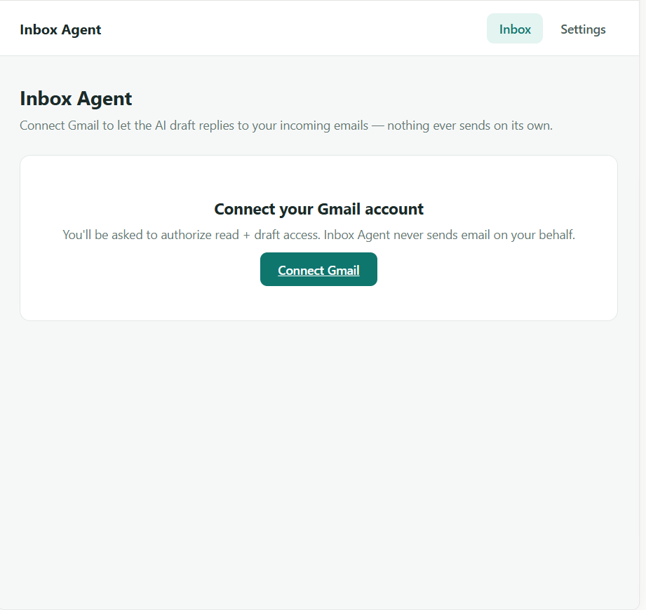
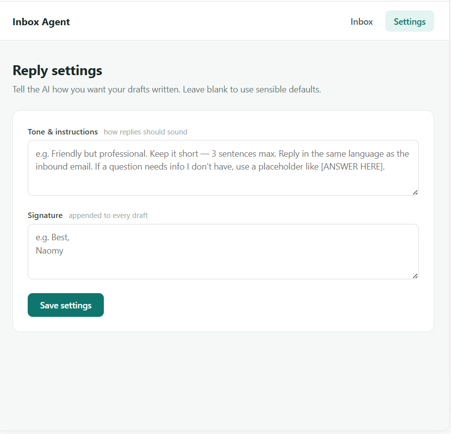

# Inbox Agent


**[Live demo](https://inbox-agent-jade.vercel.app)**




Inbox Agent watches your Gmail inbox and drafts replies for you. It decides which incoming emails actually need a response (skipping newsletters and marketing), writes a reply in your tone, and saves it as a Gmail draft in the right thread — it never sends anything on its own.

## Why it exists

Most of the emails that pile up don't need a reply at all, and the ones that do usually just need a quick, well-worded response. Inbox Agent handles the triage and the first draft, so you open Gmail to a handful of ready-to-send replies instead of a wall of unread messages.

## Features

### Smart triage
- Every new email is checked against a simple question: does this actually need a reply? Marketing emails, newsletters, and notifications are skipped automatically.

### Drafts, never sends
- For emails that need a reply, the AI writes one and saves it as a Gmail draft in the original thread — addressed, subject-lined, and ready. You review and hit send yourself.

### Your tone, your rules
- A settings page lets you describe how you want replies written — tone, length, signature — reused for every draft. Leave it blank for sensible defaults (business casual, matches the inbound email's language).

## How it works

```
Click "Check inbox now"
                │
      Fetch recent emails from Gmail
                │
       AI decides: does this need a reply?
                │
      Yes → AI drafts a reply in your tone
                │
        Saved as a Gmail draft in the thread
                │
           You review and send it yourself
```

## Tech stack

| Layer | Tools |
|---|---|
| Backend | Python, FastAPI, SQLAlchemy, Pydantic, Uvicorn |
| Database | SQLite (local), PostgreSQL (production) |
| Email | Gmail API (OAuth 2.0) — read + draft scopes only, never send |
| AI | OpenAI-compatible SDK (swappable between OpenAI, Gemini, Groq) |
| Frontend | React, Vite, JavaScript, CSS |
| Hosting | Render (backend + PostgreSQL), Vercel (frontend) |

## Run locally

### Backend

```bash
cd backend
python -m venv venv
./venv/Scripts/activate   # Windows
pip install -r requirements.txt
cp .env.example .env
uvicorn app.main:app --reload --port 8050
```

### Frontend

```bash
cd frontend
npm install
cp .env.example .env
npm run dev
```

## Setup

1. Get an LLM key (`LLM_API_KEY`, `LLM_MODEL`, `LLM_BASE_URL`) — see `.env.example` for free options (Gemini, Groq).
2. Create a Google Cloud project at [console.cloud.google.com](https://console.cloud.google.com), enable the **Gmail API**, and create an OAuth 2.0 Client ID (Web application). Add your `GOOGLE_REDIRECT_URI` as an authorized redirect URI.
3. Set `GOOGLE_CLIENT_ID`, `GOOGLE_CLIENT_SECRET`, `GOOGLE_REDIRECT_URI` in `backend/.env`.
4. Open the app, click **Connect Gmail**, and authorize.

Each user connects their own Gmail account and runs their own LLM key — nothing shared, nothing public.

## What's next

- Automatic background polling (currently manual "Check inbox now" — real auto-polling needs either a persistent worker or Gmail push notifications via Pub/Sub).
- Support for multiple connected inboxes.
- Per-sender or per-label rules (e.g. always skip a specific sender, always flag another).

## What Inbox Agent will not do

- Will not send an email on your behalf — every reply is saved as a draft only.
- Will not read or draft on emails you sent yourself.
- Will not fabricate answers — unclear details are left as a placeholder for you to fill in.
